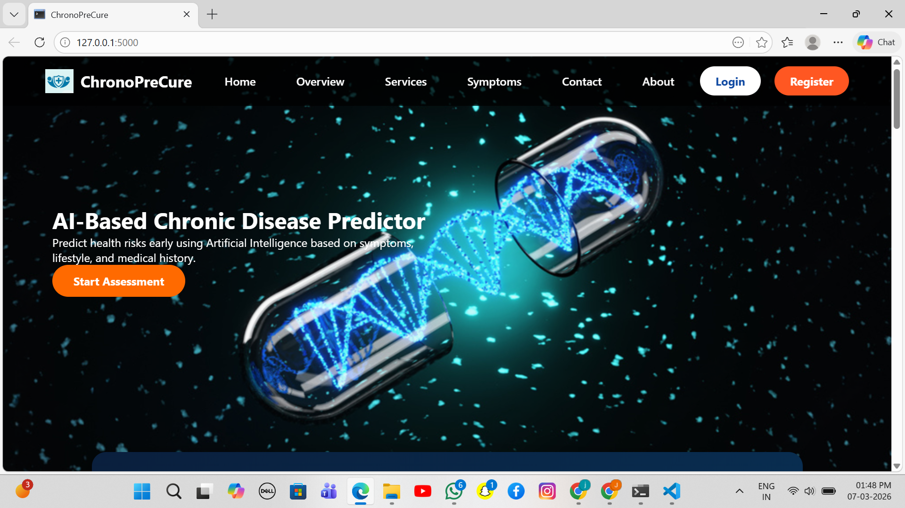
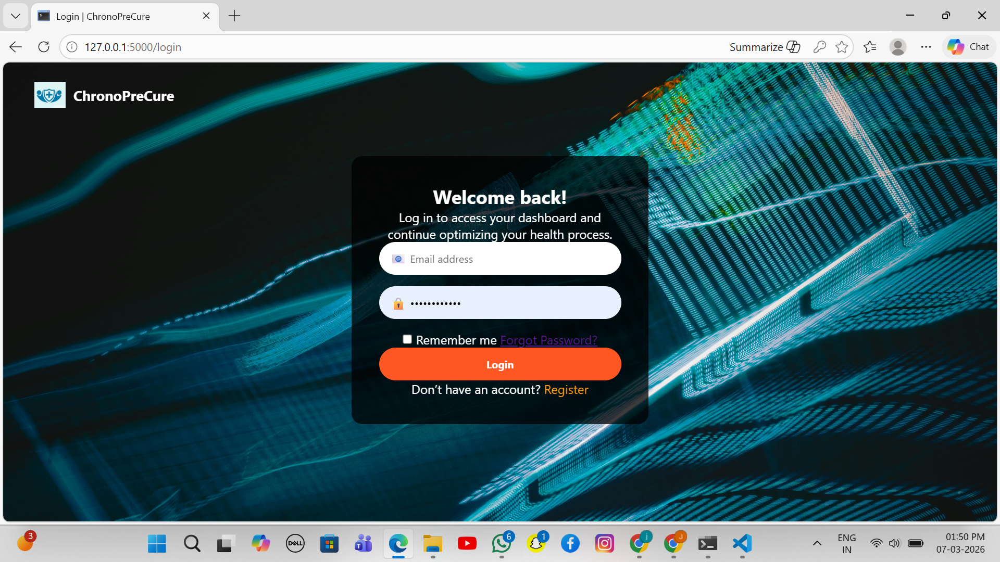
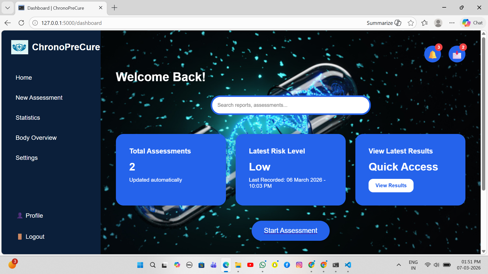
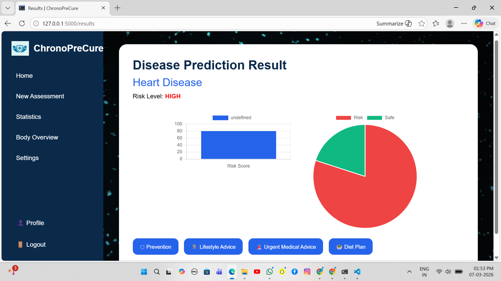
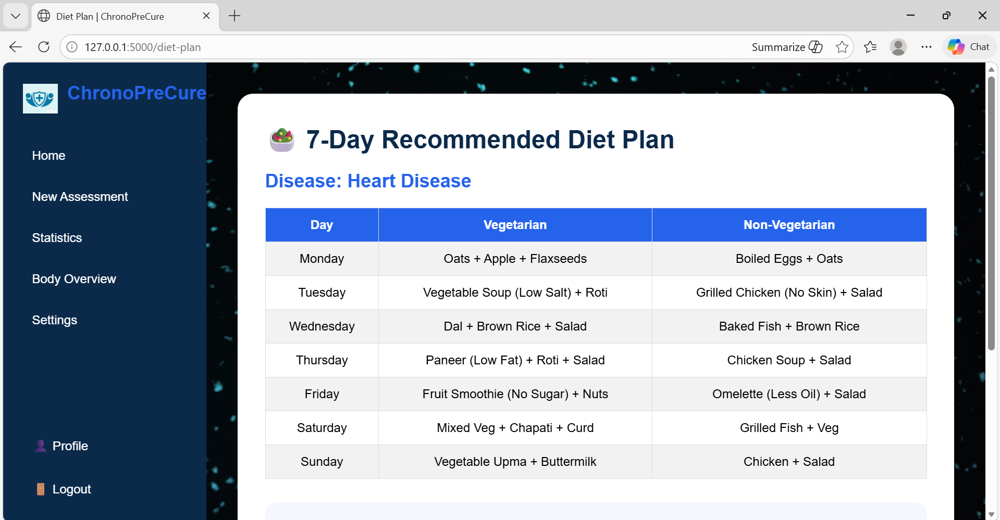

# ChronoPreCure – AI Chronic Disease Predictor

AI-powered web application for predicting chronic disease risk using machine learning and patient health data.

## Overview
ChronoPreCure is an AI-powered web application that predicts chronic disease risk using patient health data and machine learning.

## Features
- User login and registration
- Health assessment form
- Disease risk prediction
- Dashboard with results
- Diet plan suggestions
- Responsive UI

## Technologies Used
- Python
- Flask
- HTML
- CSS
- SQLite
- Machine Learning

## Project Structure
- app.py
- templates/
- static/
- models/
- datasets/
- instance/

## How to Run
1. Clone the repository
2. Install dependencies
3. Run `python app.py`

## Output
The system predicts disease risk based on input health data and displays the result on the dashboard.

## System Architecture

The ChronoPreCure system follows a simple three-layer architecture.

Frontend Layer  
The user interface is built using HTML and CSS. It allows users to enter their health details, view predictions, and navigate through different pages of the application.

Backend Layer  
The backend is developed using Python Flask. It handles routing, user input processing, and communication between the frontend and the machine learning model.

Machine Learning Layer  
The trained model processes the input health data and predicts the risk of chronic diseases based on patterns learned from the dataset.

## Implementation

The system collects health parameters from the user through a web form. These inputs are processed and converted into a format suitable for the trained machine learning model. The model then predicts the probability of disease risk and returns the result to the Flask backend, which displays the prediction on the dashboard.

The trained model and preprocessing encoders are stored as serialized files and loaded during application runtime for fast prediction.

## Advantages

• Provides early risk prediction for chronic diseases  
• Simple and user-friendly web interface  
• Quick prediction using trained machine learning models  
• Helps users become more aware of their health conditions

## Future Scope

• Integrating more diseases for prediction  
• Improving accuracy using advanced machine learning models  
• Adding real-time health monitoring using wearable devices  
• Implementing an AI chatbot to provide health guidance  
• Deploying the system on cloud platforms for wider accessibility

## Conclusion

ChronoPreCure demonstrates how machine learning and web technologies can be combined to build an intelligent health prediction system. The application helps users understand potential disease risks early and encourages proactive health management.

## Screenshots

<table>
<tr>
<td align="center">
<b>Home Page</b> 

</td>

<td align="center">
<b>Login Page</b> 

</td>
</tr>

<tr>
<td align="center">
<b>Dashboard</b> 

</td>

<td align="center">
<b>Prediction Result</b> 

</td>
</tr>

<tr>
<td align="center">
<b>Diet Plan Page</b> 

</td>
</tr>
</table>
